<!--
===============================================================================
file_id: SOM-DOC-0004-v1.0.0
name: ARCHITECTURE.md
description: Technical architecture documentation with diagrams
project_id: BROWSER-MIXER-ANON
category: documentation
tags: [architecture, diagrams, technical]
created: 2025-01-23
modified: 2025-01-23
version: 1.0.0
agent_id: AGENT-PRIME-001
execution: Documentation file
===============================================================================
-->

# Privacy Proxy - Technical Architecture

This document provides detailed technical architecture diagrams and explanations of how the Privacy Proxy system works.

## Table of Contents
- [System Overview](#system-overview)
- [Component Architecture](#component-architecture)
- [Data Flow](#data-flow)
- [Database Schema](#database-schema)
- [Request Processing Pipeline](#request-processing-pipeline)
- [Fingerprint Rotation Logic](#fingerprint-rotation-logic)
- [Cookie Blocking Mechanism](#cookie-blocking-mechanism)
- [Auto-Blocking System](#auto-blocking-system)

---

## System Overview

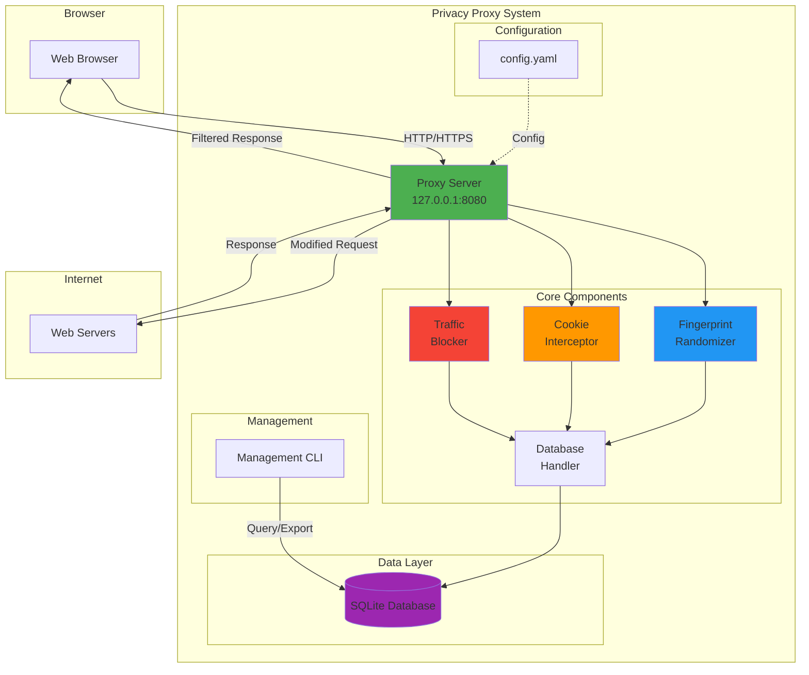

---

## Component Architecture

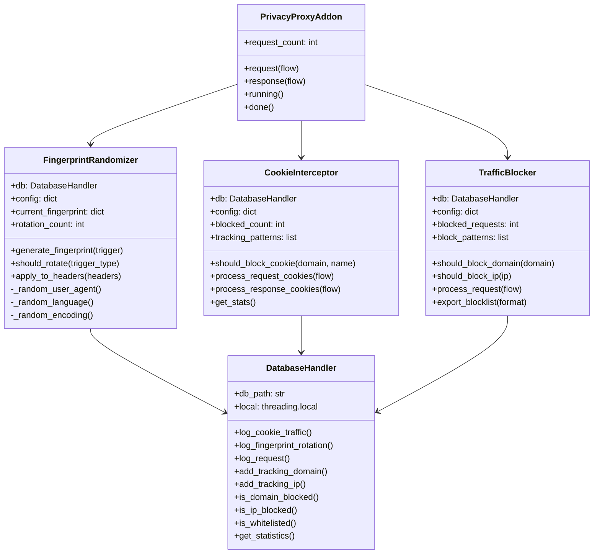

---

## Data Flow

### Request Flow (Outgoing)

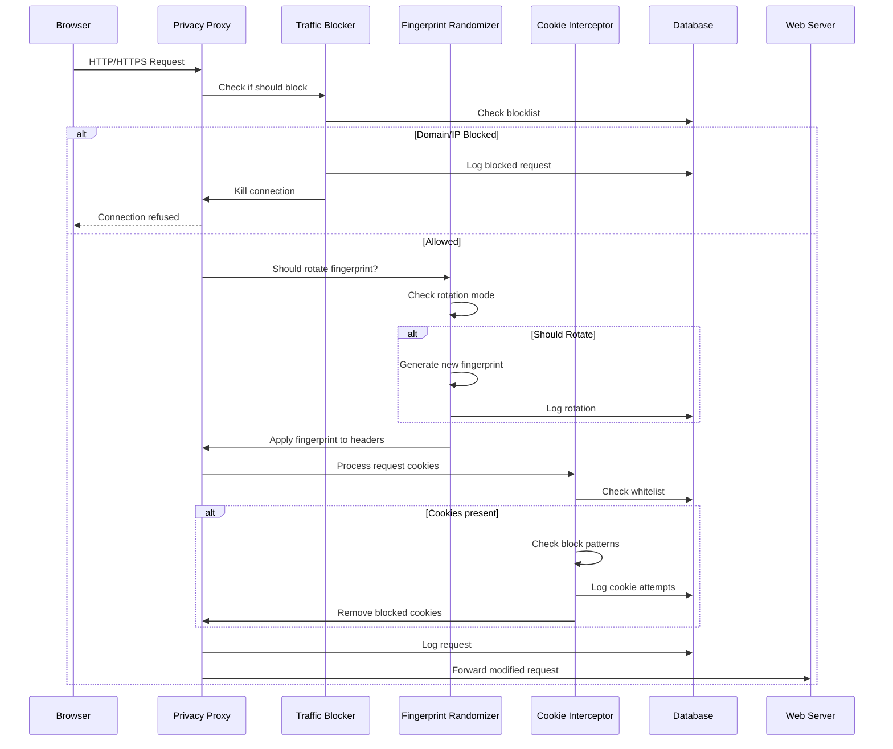

### Response Flow (Incoming)

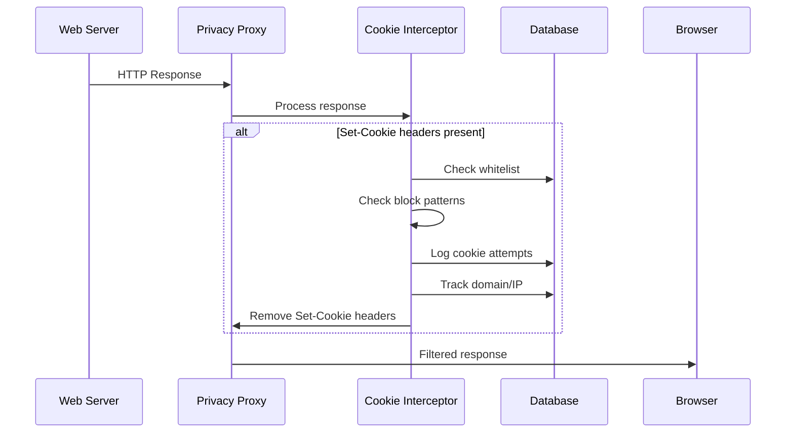

---

## Database Schema

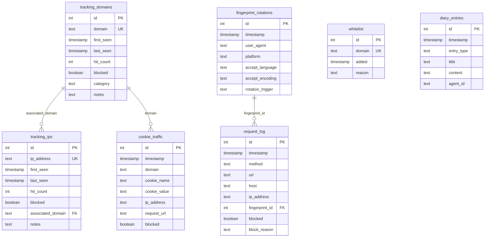

---

## Request Processing Pipeline

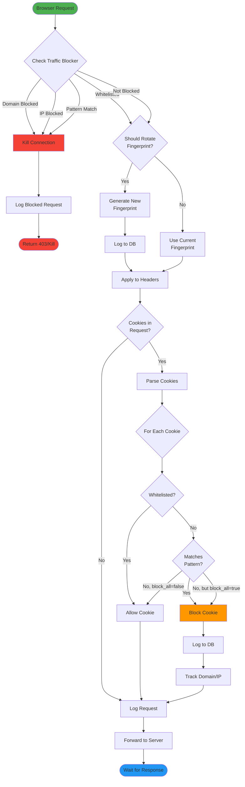

---

## Fingerprint Rotation Logic

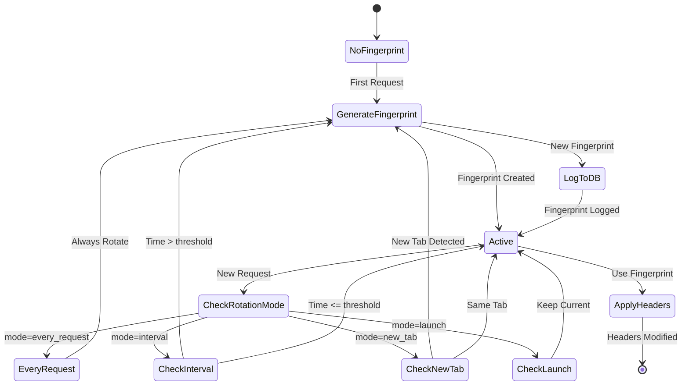

---

## Cookie Blocking Mechanism

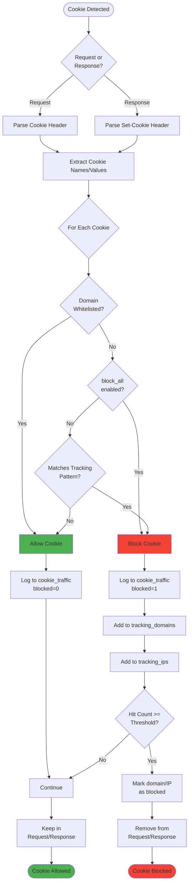

---

## Auto-Blocking System

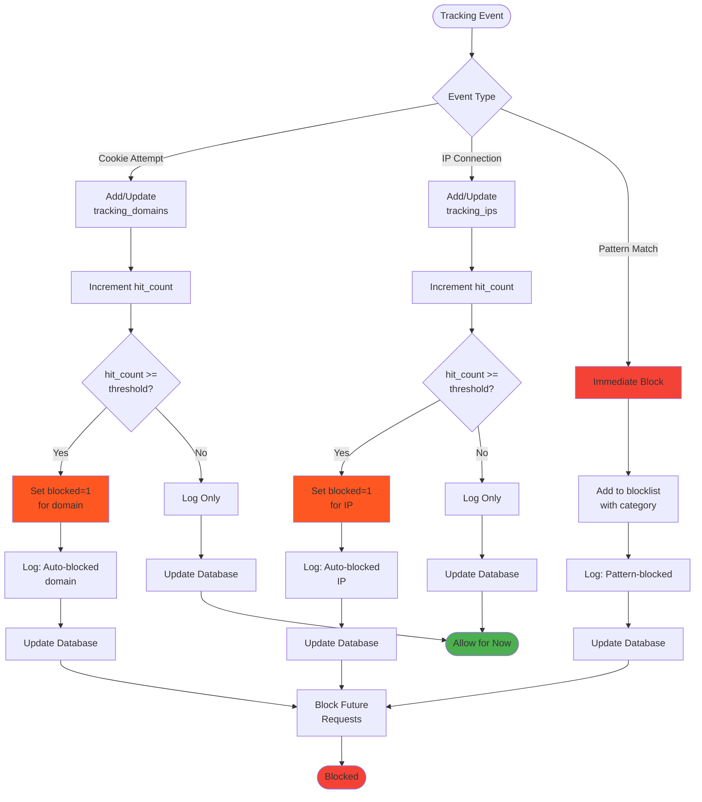

---

## Privacy Levels Comparison

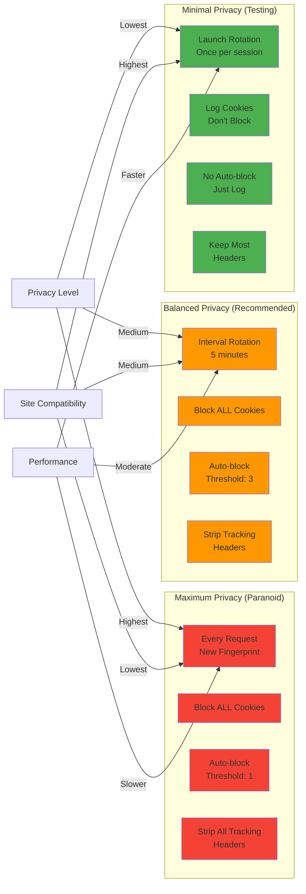

---

## Management CLI Architecture

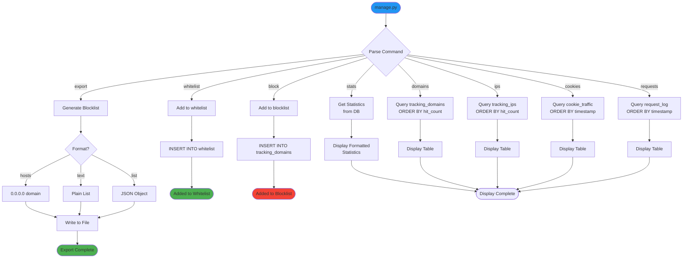

---

## Thread Safety Model

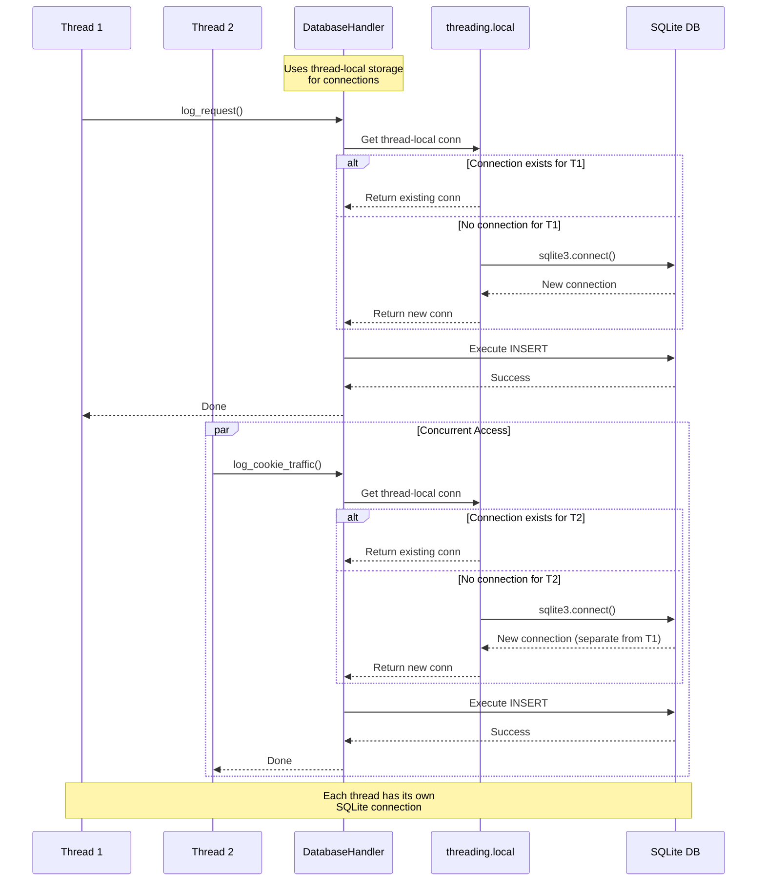

---

## Configuration Loading Flow

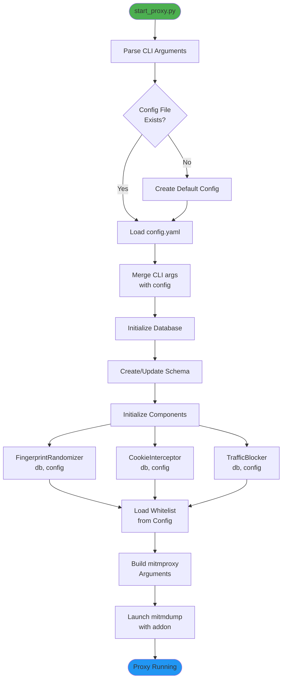

---

## System Interactions

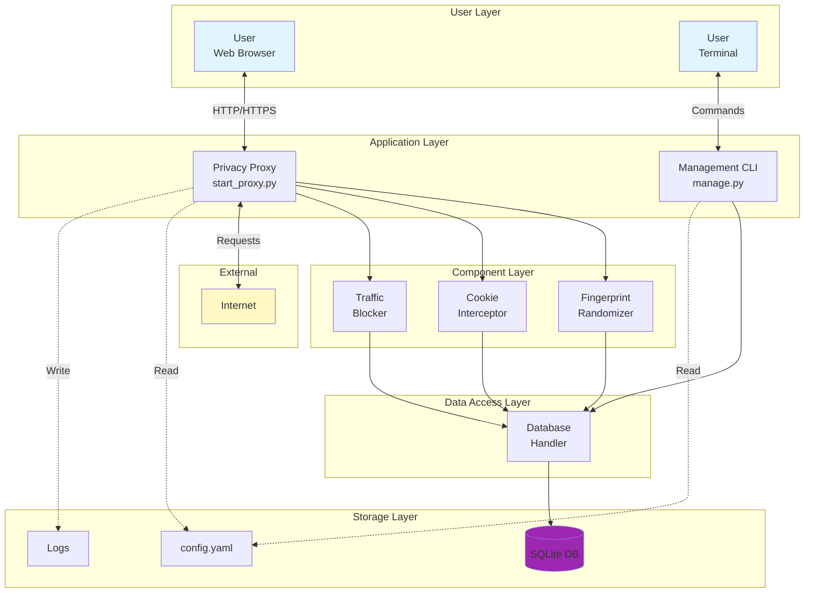

---

## Deployment Architecture

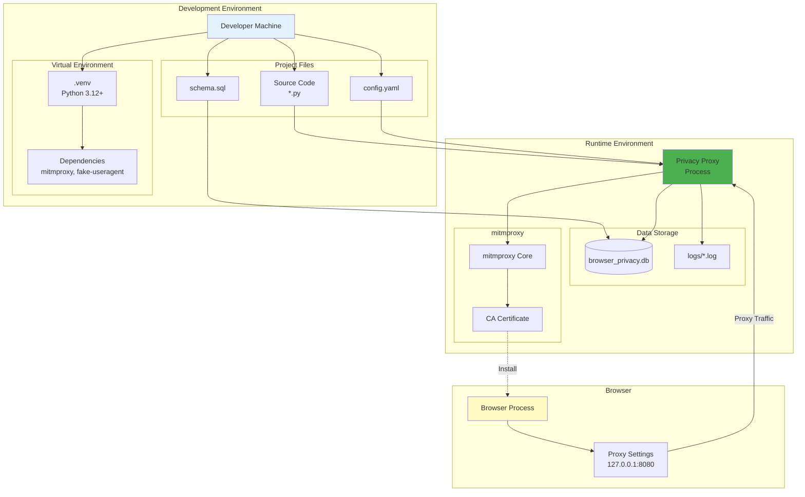

---

## Summary

The Privacy Proxy system is built on a modular architecture with clear separation of concerns:

1. **Proxy Layer**: mitmproxy handles HTTP/HTTPS interception
2. **Component Layer**: Specialized modules for fingerprinting, cookie blocking, traffic filtering
3. **Data Layer**: Thread-safe SQLite database for persistence and analysis
4. **Management Layer**: CLI tools for monitoring and configuration

The system processes each request through a pipeline that:
- Checks for blocked domains/IPs
- Rotates browser fingerprints based on configuration
- Blocks cookies bidirectionally (request and response)
- Logs all activity for analysis
- Auto-blocks trackers based on behavior patterns

This architecture provides maximum privacy while maintaining flexibility through configuration options.
